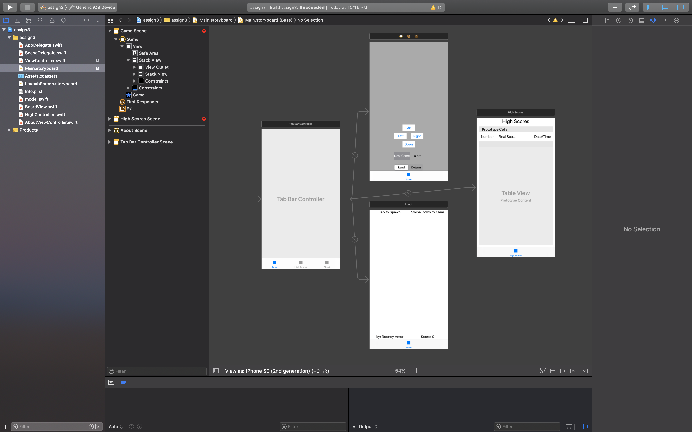
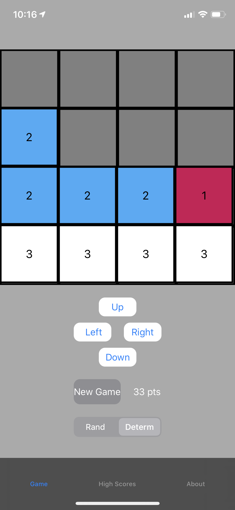
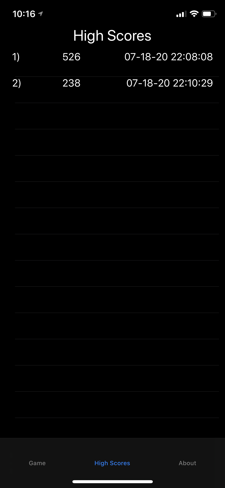

# Threes-Public-
A remake of the popular mobile game Threes where players combine numbered tiles in a grid to create higher-numbered tiles. Implemented using the Model-View-Controller design pattern and features swipe gesture functionality (UISwipeGestureRecognizer). 

Because this was a class project, I am not posting the code in public. The actual project is stored in a private repository. 

What it looks like in Storyboard

Main menu

High Score Menu (TableView)

